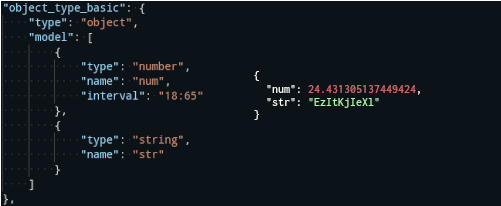

# FakeIt </br> <sup><sup><sub><sub>A Weekend Project</sub></sub></sup></sup>



## Description

### Intro

Generate API `GET` endpoints to return objects defined in a json file.
Get object with values set to random data for each endpoint call.

Running the project will result in a FastAPI application served on host `0.0.0.0` and port `9876`.
Since it is built using FastAPI, swagger UI is available at `0.0.0.0:9876/docs`.

### How to run

#### Python and Poetry

The project is written using Python 3.9 and Poetry for dependency management.

To see the generated endpoint using the example.json, run the commands:
```shell
$ poetry install
$ poetry run python fakeit/main.py example.json
```

Define your json file and pass it as the input argument.

#### Docker

Docker can be used to run the same example.json.

Use docker-compose to run the container, with optional detached flag to run in background and build flag if you changed files and want to rebuild and run:
```shell
$ docker-compose up -d --build
```


You can either use curl, open the swagger UI, or write your client to call the defined endpoints.
For swagger, the same location `0.0.0.0:9876/docs` can be used to see the result.

To stop the container, run

```shell
$ docker-compose down
```

#### Configure port and input file

In case you are using python, you can set the -p or --port argument as integer.
Input file path is required.
The following example will use port `1357` and file `abc.json`.

```shell
$ poetry run python fakeit/main.py abc.json -p 1357
```

When using docker, pass the arguments before the docker-compose command.
The following example uses the same arguments as the previous one.

```shell
$ PORT=1357 INPUT=abc.json docker-compose up -d --build
```

Make sure to use the --build flag if the image was already built, to avoid using cached files.

## Json definitions

The input json hold definitions of route paths, and the schemas returned by the endpoint.
The key `routes` must exist, and it must define objects to map routes and schemas.

### Basic working example

```json
{
    "paths": {
        "abc": {
            "type": "boolean"
        }
    }
}
```

Here the path `abc` will return a single `boolean` value.


### Schema definition

The attributes of a schema definition are:

- type
- name
- interval
- model


#### <u>name</u>

`name` attribute is optional, but if left out, defines if the result from calling an endpoint is a single value or a object.

In the basic working example name is left out, so the result is a single value.
If the name is added, the result will be an object that looks like `{"name": value}`.

#### <u>interval</u>

`interval` attribute is optional and in case of a boolean type unnecessary.

For a number type, it defines the minimum and maximum value. If it is left out, the values returned are in the limits 0 <= x < 1.

For a string and an array type, it defines the minimum and maximum length. If the value is negative for these two types, it will result in the length of 0 (zero). If left out, the default length is 10.

Interval can be defined as either an integer, or a string.
In case of a string, it can have the format `"min:max"`, where min and max must again be integers to be able to parse the limits.

An example interval defined by a string is "10:20". The first value can also be left out, so the interval is defined as ":20". here the min value is set to 0 by default. The max value can't be left out.

#### <u>model</u>

The `model` attribute is used if the type attribute is equal to `object`.

It holds a list of schemas with the same attributes listed above.
This makes it possible to nest the schemas and create complex objects.

#### <u>type</u>

The `type` attribute is always required.

Values of the type attribute can be:

- boolean
- number
- string
- array
- complex

If the value is `boolean`, the only other relevant attribute will be `name`.
So, the result will be either a `boolean` value or an object looking like `{"name", boolean}`

If the value is `number`, the other relevant attributes are `name` and `interval`.
The return value will be a `float` with the interval defining the min and max values.

If the value is `string`, the other relevant attributes are `name` and `interval`.
The return value will be a `string` with the length between min and max defined by the interval.

If the value is `array`, the `type` also has to hold the array items type.
The full format for the array type is:

`"array:itemsType:itemsMin:itemsMax"`.

The `itemsType` is required and has to be boolean, string, or number. The `itemsMin` and `itemsMax` define the interval for the item type and are optional. The behaviour of this interval is the same as described before.
Again, the `name` attribute will result in an object, and the `interval` will deine the min and max length of the array itself.

If the value is `complex`, the definition also has to have the `model` attribute.
This type is used to define any objet that is more complex than the rest of the types.
The interval here is not necessary, and the `name` is required for all but the root object.
If the nested schemas do not have the names defined, the value for the keys will be set to "null".

### Examples

For a better idea of how to define the json file, look at the `example.json`.
It holds basic examples for all types, and how to create complex objects.

